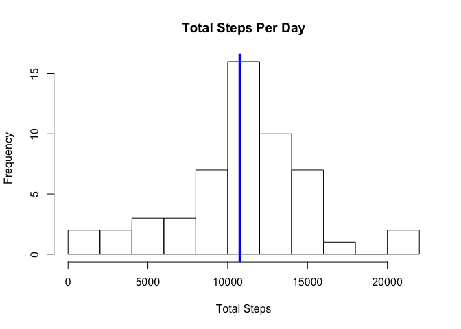
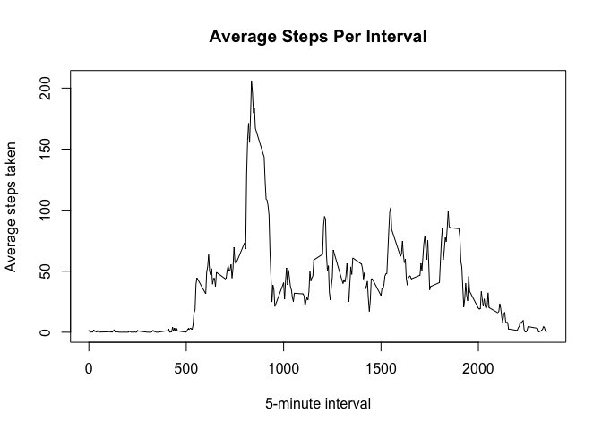
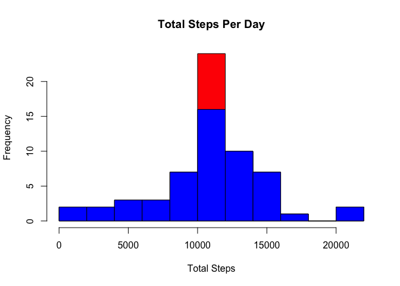
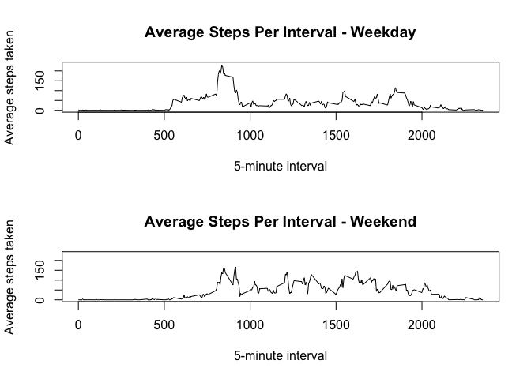

Analyzing Activity Monitoring Dataset
=========================

# Introduction

It is now possible to collect a large amount of data about personal movement using activity monitoring devices such as a Fitbit, Nike Fuelband, or Jawbone Up. These type of devices are part of the “quantified self” movement – a group of enthusiasts who take measurements about themselves regularly to improve their health, to find patterns in their behavior, or because they are tech geeks. But these data remain under-utilized both because the raw data are hard to obtain and there is a lack of statistical methods and software for processing and interpreting the data.  

This assignment makes use of data from a personal activity monitoring device. This device collects data at 5 minute intervals through out the day. The data consists of two months of data from an anonymous individual collected during the months of October and November, 2012 and include the number of steps taken in 5 minute intervals each day.  

## Loading and preprocessing the data

Unzip files and load the data.


```r
unzip("activity.zip")
activity <- read.csv(file = "activity.csv")
```

## What is mean total number of steps taken per day?

Calculate the total number of steps taken per day.


```r
steps.per.day <- aggregate(steps ~ date, activity, FUN = sum)
```

Make a histogram of the total number of steps taken each day.


```r
hist(steps.per.day$steps, breaks = 10, main = "Total Steps Per Day", xlab = "Total Steps")
abline(v = median(steps.per.day$steps), col = "blue", lwd = 4)
```

\

Calculate and report the mean and median of the total number of steps taken per day.


```r
paste("Mean number of steps in a day:", mean(steps.per.day$steps), sep = " ")
```

```
## [1] "Mean number of steps in a day: 10766.1886792453"
```

```r
paste("Median number of steps in a day:", median(steps.per.day$steps), sep = " ")
```

```
## [1] "Median number of steps in a day: 10765"
```

## What is the average daily activity pattern?

Calculate the average number of steps taken per 5-minute interval.


```r
steps.per.interval <- aggregate(steps ~ interval, activity, FUN = mean)
```

Make a time series plot of the 5-minute interval and the average number of steps taken, averaged across all days 


```r
plot(steps.per.interval$interval, steps.per.interval$steps, 
     type = "l", xlab = "5-minute interval", 
     ylab = "Average steps taken", 
     main = "Average Steps Per Interval")
```

\

Which 5-minute interval, on average across all the days in the dataset, contains the maximum number of steps?


```r
paste("Interval with maximum number of steps:", 
      steps.per.interval[which.max(steps.per.interval$steps), 1], sep = " ")
```

```
## [1] "Interval with maximum number of steps: 835"
```

## Imputing missing values

In order to impute missing values I will calcualte the mean for each 5-minute interval and use that value instead where measurements are not available. 

Calculate and report the total number of missing values in the dataset.


```r
paste("Number of missing values in the data:", nrow(subset(activity, is.na(steps))), sep = " ")
```

```
## [1] "Number of missing values in the data: 2304"
```

Impute missing values using the average steps per interval.  

First I will create 2 datasets, one that is cleaned of any missing values and one that containts all the missing values. 


```r
activity.notna <- activity[!is.na(activity$steps), ]
activity.na <- activity[is.na(activity$steps), ]
```

Create a new imputed dataset by merging the NA dataset with the 5-minute interval means we calculated earlier. I also select just the columns needed to join this data back to the cleaned dataset and fix the column names so they match. 


```r
activity.imputed <- merge(activity.na, steps.per.interval, by=c("interval"))[, c(4, 3, 1)]
colnames(activity.imputed) <- colnames(activity)
```

Create a new dataset that is equal to the original dataset but with the missing data filled in.


```r
activity.imputed <- rbind(activity.imputed, activity.notna)
```

Make a histogram of the total number of steps taken each day and Calculate and report the *mean* and *median* total number of steps taken per day. Do these values differ from the estimates from the first part of the assignment? What is the impact of imputing missing data on the estimates of the total daily number of steps?

Calculate the total number of steps taken per day using the new dataset with imputed values. 


```r
steps.per.day2 <- aggregate(steps ~ date, activity.imputed, FUN = sum)
```

Make a histogram of the total number of steps taken each day.


```r
hist(steps.per.day2$steps, breaks = 10, main = "Total Steps Per Day", xlab = "Total Steps", col = "red")
hist(steps.per.day$steps, breaks = 10, main = "Total Steps Per Day", xlab = "Total Steps", col = "blue", add = T)
```

\

You can see from the histogram that our imputed data seems to fall into the histogram bin where the median and mean were located. 

Calculate and report the mean and median of the total number of steps taken per day for the dataset containing imputed values vs. the original.


```r
paste("Mean number of steps in a day (original):", mean(steps.per.day$steps), sep = " ")
```

```
## [1] "Mean number of steps in a day (original): 10766.1886792453"
```

```r
paste("Mean number of steps in a day (imputed):", mean(steps.per.day2$steps), sep = " ")
```

```
## [1] "Mean number of steps in a day (imputed): 10766.1886792453"
```


```r
paste("Median number of steps in a day (original):", median(steps.per.day$steps), sep = " ")
```

```
## [1] "Median number of steps in a day (original): 10765"
```

```r
paste("Median number of steps in a day (imputed):", median(steps.per.day2$steps), sep = " ")
```

```
## [1] "Median number of steps in a day (imputed): 10766.1886792453"
```

Unsurprisingly since mean values were used to impute missing data, the mean and median remain largely unchanged. 

## Are there differences in activity patterns between weekdays and weekends?

First use the weekdays function to add a day of week column to our imputed dataset. Next use this field to create a factor column with 2 levels, Weekend and Weekday.  


```r
activity.imputed$dow <- weekdays(as.Date(activity.imputed$date))
activity.imputed$wd <- as.factor(ifelse(activity.imputed$dow %in% c("Saturday","Sunday"), 
                              "Weekend", "Weekday"))   
```

Calculate the average number of steps taken per 5-minute interval for each level of the weekday factor. Save these to 2 new datasets, one containing the averages for weekdays and one for weekends. 


```r
weekday <- aggregate(steps ~ interval, activity.imputed[activity.imputed$wd == "Weekday", ], FUN = mean)
weekend <- aggregate(steps ~ interval, activity.imputed[activity.imputed$wd == "Weekend", ], FUN = mean)
```

Make a panel plot containing a time series plot of the 5-minute interval (x-axis) and the average number of steps taken, averaged across all weekday days or weekend days (y-axis)


```r
par(mfrow = c(2,1))
plot(weekday$interval, weekday$steps, 
     ylim = c(0, 235),
     type = "l", xlab = "5-minute interval", 
     ylab = "Average steps taken", 
     main = "Average Steps Per Interval - Weekday")
plot(weekend$interval, weekend$steps, 
     ylim = c(0, 235),
     type = "l", xlab = "5-minute interval", 
     ylab = "Average steps taken", 
     main = "Average Steps Per Interval - Weekend")
```

\

